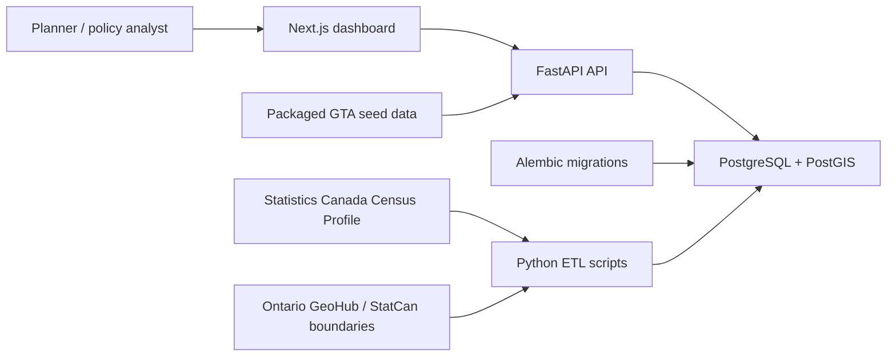

# CivicScope

A geospatial civic analytics platform that helps users explore housing affordability, income, population growth, and access patterns across Greater Toronto Area communities using public-data-ready workflows.

## Overview

CivicScope is a portfolio-grade full-stack project for public-sector analytics. The MVP includes a FastAPI backend, SQLAlchemy data model, Postgres/PostGIS Docker stack, packaged Greater Toronto Area seed data, tested API endpoints, repeatable Statistics Canada ETL scripts, and a Next.js dashboard with an interactive MapLibre map, municipality/census-tract level switching, summary cards, comparison chart, search, and detail panel.

Municipal geometries use Statistics Canada 2021 cartographic census subdivision boundaries. Metric values use official Statistics Canada 2021 Census Profile characteristics for the selected GTA municipalities.

Census tract geometries use Statistics Canada 2021 cartographic census tract boundaries filtered to the selected GTA municipalities. Packaged tract metrics are clearly labeled estimates derived from parent municipality values so the app works offline; they are intended as a demo layer until tract-level Census Profile metrics are loaded.

## Screenshots

Demo video:

[CivicScope demo walkthrough](docs/demo/civicscope-demo.webm)

Overview dashboard with GTA municipal rent burden:


Selected municipality drilldown:


Population growth metric view:


Census tract map layer:


Regenerate screenshots from the running app:

```bash
cd frontend
npm run screenshots
```

Regenerate the demo video from the running app:

```bash
cd frontend
npm run demo:video
```

## Case Study

CivicScope answers a practical planning question: where are GTA housing affordability conditions most strained relative to local incomes, and how do those conditions differ between nearby municipalities and census tracts?

The core workflow is designed for a policy analyst or planner: scan the regional overview, switch metrics, search or click a geography, inspect local affordability indicators, and compare selected areas. The app intentionally separates official municipal metrics from estimated tract metrics with visible data-quality labels.

See [docs/case-study.md](docs/case-study.md) for the full project narrative.

See [docs/tract-metric-upgrade.md](docs/tract-metric-upgrade.md) for the official tract-metric upgrade path.

## Architecture



## Project Structure

```text
civicscope/
  backend/
    app/
    alembic/
    etl/
    tests/
  frontend/
    app/
    components/
    lib/
    types/
  docs/
    case-study.md
    demo/
    etl.md
    launch-checklist.md
    tract-metric-upgrade.md
    deployment.md
    screenshots/
  docker-compose.yml
  render.yaml
  Makefile
```

## Setup

Copy the example environment file if you want local overrides:

```bash
cp .env.example .env
```

Production-style environment values are documented in `.env.production.example`.

Run the full stack with Docker:

```bash
docker compose up --build
```

If port `3000` is already in use, set `FRONTEND_PORT=3001` in `.env` and run the same command.

Local URLs:

- Frontend: http://localhost:3000 or http://localhost:3001 when `FRONTEND_PORT=3001`
- Backend API: http://localhost:8000
- API docs: http://localhost:8000/docs
- Health: http://localhost:8000/health

Run services manually:

```bash
cd backend
pip install -r requirements.txt
alembic upgrade head
uvicorn app.main:app --reload
```

```bash
cd frontend
npm install
npm run dev
```

## API Reference

| Endpoint | Purpose |
| --- | --- |
| `GET /health` | Service and database health check. |
| `GET /api/geographies` | List/search GTA geographies. Defaults to municipalities; pass `type=census_tract` for tracts. |
| `GET /api/geographies/{id}` | Get one geography by internal id or GEOID. |
| `GET /api/metrics?metric=rent_burden` | Return metric values by geography. |
| `GET /api/summary` | GTA summary. |
| `GET /api/summary?ids=3520005` | Summary for selected geography IDs. |
| `GET /api/compare?ids=3520005,3521005` | Compare selected geographies. |
| `GET /api/map-data?metric=affordability_index` | GeoJSON FeatureCollection for map rendering. |
| `GET /api/map-data?metric=rent_burden&detail=display` | Map-ready GeoJSON simplified with PostGIS when available. Add `type=census_tract` for tract-level map data. |

Supported metrics:

- `median_income`
- `median_rent`
- `rent_burden_pct`
- `population`
- `population_growth_pct`
- `affordability_index`
- `rent_to_income_ratio`

Aliases such as `rent_burden`, `income`, `rent`, and `growth` are accepted by the backend.

## Data Sources

The packaged seed covers GTA lower/single-tier municipalities:

- Toronto
- Peel municipalities: Mississauga, Brampton, Caledon
- York municipalities: Vaughan, Markham, Richmond Hill, Aurora, Newmarket, King, Whitchurch-Stouffville, East Gwillimbury, Georgina
- Durham municipalities: Pickering, Ajax, Whitby, Oshawa, Clarington, Uxbridge, Scugog, Brock
- Halton municipalities: Oakville, Burlington, Milton, Halton Hills

It also includes 1,334 packaged census tract features assigned to those municipalities by tract centroid. Tract boundaries are official 2021 Statistics Canada cartographic census tract polygons; tract metric values are estimated for demo use and should be replaced before publication-grade tract analysis.

Current and planned sources:

- Statistics Canada Census Profile Web Data Service/downloads for income, shelter costs, population, renters, and affordability indicators.
- Statistics Canada 2021 Cartographic Boundary Files for census subdivisions and census tracts.
- Ontario GeoHub municipal boundaries for provincial municipal layers.
- Optional CMHC rental market data for rent context.
- Optional GTFS transit stop data from TTC, GO Transit, MiWay, Brampton Transit, York Region Transit, Durham Region Transit, and Burlington/Oakville/Milton providers for access scoring.

## Metric Definitions

`rent_to_income_ratio = annualized median rent / median household income`

`affordability_index = 100 * (0.30 / rent_to_income_ratio)`

An affordability score of 100 means median rent is exactly 30 percent of median household income. Higher values indicate more affordability. GTA `rent_burden_pct` values come from the Statistics Canada Census Profile tenant shelter-cost burden characteristic.

Summary cards use weighted averages of local median values, which are useful for a demo dashboard but should not be treated as official regional medians.

## ETL Workflows

Print the official Statistics Canada CSD boundary query URL:

```bash
docker compose exec backend python etl/load_geo.py --print-url
```

Load GTA municipal boundaries from the Statistics Canada cartographic boundary service:

```bash
docker compose exec backend python etl/load_geo.py
```

Print the official Statistics Canada census tract boundary query URL:

```bash
docker compose exec backend python etl/load_tracts.py --print-url
```

Load packaged census tract rows into an existing local database:

```bash
docker compose exec backend python etl/load_tracts.py --from-seed
```

Refresh packaged census tract rows from a Statistics Canada CT GeoJSON file or URL:

```bash
docker compose exec backend python etl/load_tracts.py --update-seed --geojson /app/data/statcan_ct.geojson
```

Refresh the packaged offline seed geometries from the same official service:

```bash
docker compose exec backend python etl/load_geo.py --update-seed
```

Print a Census Profile WDS URL for selected CSDUIDs and characteristic IDs:

```bash
docker compose exec backend python etl/load_census.py --print-profile-url 3520005 3521005 --characteristics 1 2 229 1476 1478 1480
```

Load official 2021 Census Profile metrics for all 25 GTA municipalities:

```bash
docker compose exec backend python etl/load_census.py --official-gta
```

Refresh the packaged offline seed metrics from the official Census Profile API:

```bash
docker compose exec backend python etl/load_census.py --update-seed
```

Load a normalized Census Profile CSV extract:

```bash
docker compose exec backend python etl/load_census.py --csv /app/data/statcan_metrics.csv
```

More details are in `docs/etl.md`.

## Database Migrations

Docker Compose runs `alembic upgrade head` before starting Uvicorn, and the FastAPI app verifies the database is on the expected migration revision during startup. The current migration creates the core tables, enables PostGIS, adds `geographies.geom geometry(GEOMETRY, 4326)`, backfills it from stored GeoJSON, and creates a GiST spatial index.

Run migrations manually:

```bash
docker compose exec backend alembic upgrade head
```

Check migration state:

```bash
docker compose exec db psql -U civicscope -d civicscope -c "SELECT version_num FROM alembic_version;"
```

## Testing

Backend:

```bash
cd backend
pytest
```

Frontend:

```bash
cd frontend
npm run typecheck
npm run build
```

Browser regression tests:

```bash
cd frontend
npx playwright install chromium
npm run test:e2e
```

The Playwright suite expects the backend API to be running at `NEXT_PUBLIC_API_URL` or `http://127.0.0.1:8000`.
It starts a separate Next.js test server on port `3101` by default so it does not conflict with the normal local dashboard port.

Screenshot generation:

```bash
cd frontend
npm run screenshots
```

## Deployment Notes

See `docs/deployment.md` for a deployment checklist.
See `docs/launch-checklist.md` for the exact GitHub, Render, and Vercel launch sequence.

Recommended split:

- Backend API: Render, Fly.io, or Railway with managed PostgreSQL/PostGIS.
- Frontend dashboard: Vercel with `NEXT_PUBLIC_API_URL` pointed at the deployed FastAPI service.
- Render Blueprint: `render.yaml`
- Vercel project config: `frontend/vercel.json`
- Migrations: run `alembic upgrade head` as a release step before backend startup.
- CORS: set `CORS_ORIGINS` to the deployed frontend URL and any local preview URLs needed for testing.

SQLite test databases still use SQLAlchemy metadata creation for fast isolated tests.

## Resume Bullets

- Built CivicScope, a geospatial housing-affordability analytics platform using Next.js, FastAPI, PostgreSQL/PostGIS, and public-data-ready workflows to visualize rent burden and income patterns across Greater Toronto Area municipalities and census tracts.
- Designed ETL-ready civic data workflows for Statistics Canada municipal and census tract boundary loading, Census Profile metric normalization, PostGIS geometry indexing, and GeoJSON API delivery for interactive map visualizations.
- Implemented production-style API, database, testing, and Docker workflows for a public-sector analytics dashboard used to compare housing affordability across regions.

## Current Limitations

- Packaged seed data remains available for offline demos even though the database can refresh boundaries and metrics from Statistics Canada.
- The native PostGIS `geom` column is currently backfilled from stored GeoJSON; a future migration can make it the canonical geometry store.
- Census tract boundaries are included, but packaged tract metrics are estimated from parent municipality values. The next data-quality upgrade is loading official tract-level Census Profile metrics.
- Dissemination areas and parcel-level workflows remain planned expansion paths.
- Transit/access scoring is intentionally not implemented yet; GTFS ingestion is the next domain feature after deployment polish.
