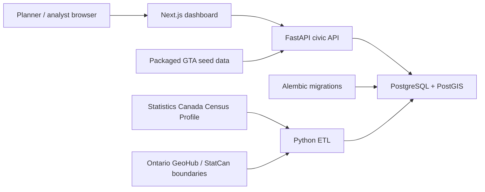

# CivicScope Architecture

## Phase 1-3 shape

CivicScope is split into a typed Next.js frontend and a FastAPI backend. The backend owns metric formulas, seed loading, API validation, geography-level filtering, and GeoJSON delivery. The frontend fetches map features with all available metrics for the active geography level, then switches the active map metric locally so dropdown changes repaint immediately without waiting on another map request.

The Docker Compose stack starts:

- `db`: PostgreSQL with PostGIS enabled.
- `backend`: FastAPI with SQLAlchemy models, Alembic migration verification, and automatic packaged-data seeding.
- `frontend`: Next.js dashboard backed by the FastAPI API.

## Data boundary

The MVP keeps source GeoJSON in `geographies.geometry` and backfills native PostGIS geometry in `geographies.geom`. `backend/etl/load_geo.py` can refresh GTA CSD boundaries from the Statistics Canada ArcGIS service, while `backend/etl/load_tracts.py` can load or refresh census tract boundaries. The seed/ETL path syncs `geom` after geography updates.

Map endpoints keep two geometry delivery modes: `detail=full` returns the stored boundary and `detail=display` uses `ST_SimplifyPreserveTopology` through PostGIS when available. They also accept `type=municipality` or `type=census_tract` so the same API contract supports regional and tract-scale map views. SQLite and other non-PostGIS environments fall back to Python GeoJSON compaction.

## Deployment boundary

The backend should run migrations before app startup in production. Docker Compose does this with `alembic upgrade head && uvicorn ...`; hosted environments should use the same migration command as a release step. The frontend only needs the public API base URL through `NEXT_PUBLIC_API_URL`.

See `deployment.md` for provider-oriented setup notes.
